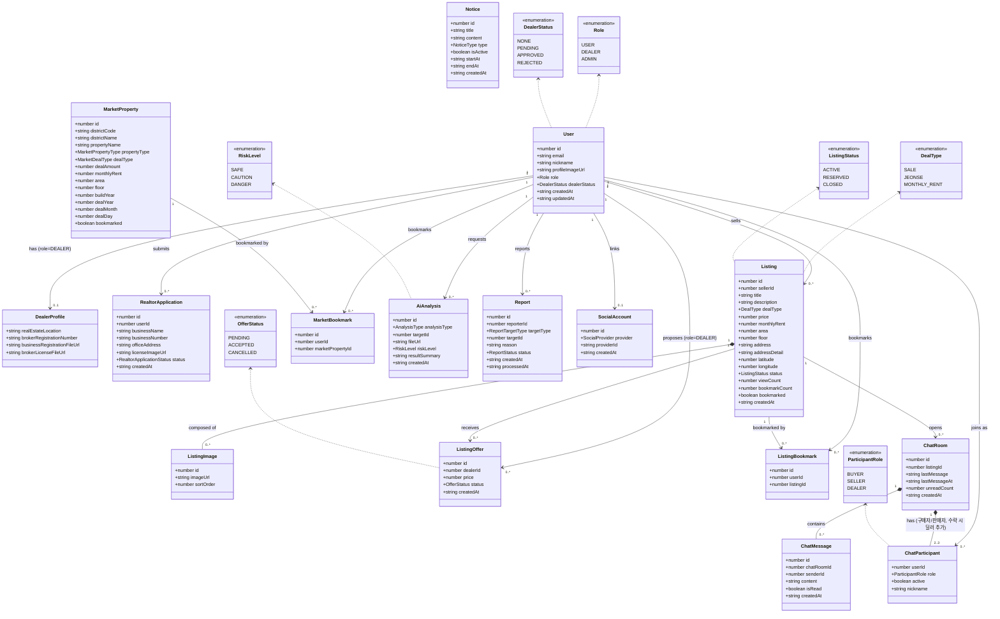

# Evervill 클래스 다이어그램 (도메인 모델)

> `src/types/*.ts`에 정의된 애플리케이션 도메인 타입을 기준으로 작성한 분석/설계 수준 클래스 다이어그램이다. 프론트엔드는 순수 데이터 타입(인터페이스)만 가지므로 메서드는 생략하고 속성·관계 중심으로 표현했다. DB 컬럼명(snake_case)과의 매핑은 `docs/er-diagram.md` 참고.

## 비고

- `ChatParticipant`는 `ChatRoom`이 생성될 때 구매자/판매자 2명으로 시작하고, `ListingOffer`가 수락(`accept`)되면 해당 공인중개사가 3번째 `ChatParticipant`(`role=DEALER`)로 추가되는 구조다(`DealerMatchModal.vue` 참고).
- `ListingOffer`는 같은 `(listing, dealer)` 조합에 대해 재제안 시 새 레코드를 만들지 않고 기존 제안을 덮어쓴다(`status` 전환은 `PENDING → ACCEPTED|CANCELLED`).
- `Report.targetType`은 FE 타입에는 명시적으로 노출되어 있지 않지만(현재는 매물 신고만 FE에서 트리거), 기존 `ERD.ts`의 `Reports.target_type ENUM('USER','LISTING')`을 그대로 승계해 표기했다.
