# Evervill ER 다이어그램

> 기존 `ERD.ts`(루트)를 베이스라인으로 삼아, 현재 FE에 구현된 기능(공인중개사 가입승인, 딜러 역경매 가격 제안, 3자 채팅)에 필요한 테이블/컬럼을 추가·수정해 최신화했다. **[NEW]**는 `ERD.ts`에 없는 신규 테이블, **[CHG]**는 기존 테이블의 변경 사항이다. 변경이 없는 테이블은 `ERD.ts`와 동일하다.

```mermaid
erDiagram
    USERS {
        bigint id PK
        varchar email
        varchar password
        varchar nickname
        enum role "USER, ADMIN, DEALER (CHG: DEALER 추가)"
        tinyint is_deleted
        datetime deleted_at
        datetime created_at
        datetime updated_at
    }

    DEALER_PROFILES {
        bigint user_id PK "FK -> USERS.id, NEW"
        varchar real_estate_location
        varchar broker_registration_number
        varchar business_registration_file_url
        varchar broker_license_file_url
        datetime created_at
        datetime updated_at
    }

    REALTOR_APPLICATIONS {
        bigint id PK "NEW"
        bigint user_id "users.id 참조"
        varchar business_name
        varchar business_number
        varchar office_address
        varchar license_image_url
        enum status "PENDING, APPROVED, REJECTED"
        datetime created_at
        datetime updated_at
    }

    SOCIAL_ACCOUNTS {
        bigint id PK
        bigint user_id FK
        enum provider "KAKAO"
        varchar provider_id
        datetime created_at
    }

    LISTINGS {
        bigint id PK
        bigint seller_id "users.id 참조 (FK 없음)"
        varchar title
        text description
        enum deal_type "SALE, JEONSE, MONTHLY"
        bigint sale_price
        bigint jeonse_price
        bigint deposit
        bigint monthly_rent
        varchar city
        varchar district
        varchar neighborhood
        varchar address_detail
        decimal latitude
        decimal longitude
        decimal area
        int floor
        enum status "ACTIVE, RESERVED, COMPLETED"
        varchar thumbnail_url
        tinyint is_deleted
        datetime deleted_at
        datetime created_at
        datetime updated_at
    }

    LISTING_IMAGES {
        bigint id PK
        bigint listing_id FK
        varchar image_url
        int sort_order
        tinyint is_deleted
        datetime deleted_at
        datetime created_at
    }

    LISTING_OFFERS {
        bigint id PK "NEW"
        bigint listing_id FK
        bigint dealer_id "users.id 참조"
        bigint price
        enum status "PENDING, ACCEPTED, CANCELLED"
        tinyint is_deleted
        datetime deleted_at
        datetime created_at
        datetime updated_at
    }

    LISTING_BOOKMARKS {
        bigint id PK
        bigint user_id "users.id 참조"
        bigint listing_id FK
        tinyint is_deleted
        datetime deleted_at
        datetime created_at
    }

    MARKET_PROPERTIES {
        bigint id PK
        varchar city
        varchar district
        varchar neighborhood
        enum deal_type "SALE, JEONSE, MONTHLY"
        bigint price
        bigint deposit
        bigint monthly_rent
        decimal area
        int floor
        date deal_date
        tinyint is_deleted
        datetime deleted_at
        datetime created_at
        datetime updated_at
    }

    MARKET_BOOKMARKS {
        bigint id PK
        bigint user_id "users.id 참조"
        bigint market_property_id FK
        tinyint is_deleted
        datetime deleted_at
        datetime created_at
    }

    CHAT_ROOMS {
        bigint id PK
        bigint listing_id FK
        tinyint is_deleted "CHG: buyer_id/seller_id 컬럼 제거 -> CHAT_ROOM_PARTICIPANTS로 이전"
        datetime deleted_at
        datetime created_at
    }

    CHAT_ROOM_PARTICIPANTS {
        bigint id PK "NEW"
        bigint chat_room_id FK
        bigint user_id "users.id 참조"
        enum role "BUYER, SELLER, DEALER"
        tinyint is_active
        datetime joined_at
    }

    CHAT_MESSAGES {
        bigint id PK
        bigint chat_room_id FK
        bigint sender_id "users.id 참조"
        text content
        tinyint is_read
        tinyint is_deleted
        datetime deleted_at
        datetime created_at
    }

    AI_ANALYSES {
        bigint id PK
        bigint user_id "users.id 참조"
        enum analysis_type "PRICE, REGISTRY"
        bigint target_id "분석 대상 매물 ID"
        varchar file_url
        enum result_level "SAFE, CAUTION, DANGER"
        text summary
        tinyint is_deleted
        datetime deleted_at
        datetime created_at
    }

    NOTICES {
        bigint id PK
        bigint author_id "users.id 참조"
        enum notice_type "NOTICE, POPUP"
        varchar title
        text content
        tinyint is_active
        datetime start_at
        datetime end_at
        tinyint is_deleted
        datetime deleted_at
        datetime created_at
        datetime updated_at
    }

    REPORTS {
        bigint id PK
        bigint reporter_id "users.id 참조"
        enum target_type "USER, LISTING"
        bigint target_id
        enum reason "SPAM, FRAUD, INAPPROPRIATE, OTHER"
        text description
        enum status "PENDING, RESOLVED, DISMISSED"
        tinyint is_deleted
        datetime deleted_at
        datetime created_at
        datetime updated_at
    }

    USERS ||--o| DEALER_PROFILES : "1:0..1 (role=DEALER)"
    USERS ||--o{ REALTOR_APPLICATIONS : submits
    USERS ||--o| SOCIAL_ACCOUNTS : links
    USERS ||--o{ LISTINGS : sells
    USERS ||--o{ LISTING_OFFERS : "proposes (dealer_id)"
    USERS ||--o{ LISTING_BOOKMARKS : bookmarks
    USERS ||--o{ MARKET_BOOKMARKS : bookmarks
    USERS ||--o{ CHAT_ROOM_PARTICIPANTS : "joins (user_id)"
    USERS ||--o{ CHAT_MESSAGES : sends
    USERS ||--o{ AI_ANALYSES : requests
    USERS ||--o{ NOTICES : authors
    USERS ||--o{ REPORTS : reports

    LISTINGS ||--o{ LISTING_IMAGES : has
    LISTINGS ||--o{ LISTING_OFFERS : receives
    LISTINGS ||--o{ LISTING_BOOKMARKS : "bookmarked by"
    LISTINGS ||--o{ CHAT_ROOMS : opens

    MARKET_PROPERTIES ||--o{ MARKET_BOOKMARKS : "bookmarked by"

    CHAT_ROOMS ||--o{ CHAT_ROOM_PARTICIPANTS : has
    CHAT_ROOMS ||--o{ CHAT_MESSAGES : contains
```

## 주요 변경 사항 요약 (`ERD.ts` 대비)

| 테이블 | 구분 | 변경 내용 | 사유 |
|---|---|---|---|
| `USERS` | CHG | `role` ENUM에 `DEALER` 추가 | 공인중개사 권한 도입 |
| `DEALER_PROFILES` | NEW | 중개업소 위치/등록번호/사업자등록증·자격증 파일 URL을 `USERS`와 1:0..1로 분리 | `User.dealerProfile` 타입 대응, `USERS` 테이블 비대화 방지 |
| `REALTOR_APPLICATIONS` | NEW | 공인중개사 가입 신청 + 승인 상태(`PENDING`/`APPROVED`/`REJECTED`) | `POST /auth/signup/realtor`, 관리자 승인 플로우 |
| `LISTING_OFFERS` | NEW | 매물별 딜러 복비 가격 제안 + 상태(`PENDING`/`ACCEPTED`/`CANCELLED`) | 딜러 역경매 기능 |
| `CHAT_ROOMS` | CHG | 고정 컬럼 `buyer_id`/`seller_id` 제거 | 제안 수락 시 딜러가 3번째 참가자로 들어오는 가변 인원 구조를 고정 2-컬럼으로 표현할 수 없음 |
| `CHAT_ROOM_PARTICIPANTS` | NEW | `chat_room_id` × `user_id` × `role(BUYER/SELLER/DEALER)` 조인 테이블로 `CHAT_ROOMS`의 참가자 컬럼 대체 | 가변 인원(2~3명) 채팅방 지원 |

## 확인이 필요한 부분 (백엔드 검증 필요)

- `CHAT_ROOMS`의 `buyer_id`/`seller_id` 제거 및 `CHAT_ROOM_PARTICIPANTS` 신설은 FE 타입(`ChatParticipant[]`)을 근거로 한 **추정**이다. FE 타입 주석에도 "백엔드 확장 예정 — 현재는 없을 수 있음"이라고 명시되어 있어, 실제 백엔드가 이 구조로 구현되어 있는지는 별도 확인이 필요하다.
- `DEALER_PROFILES`의 정확한 컬럼/필수 여부는 백엔드 Swagger로 아직 100% 교차 확인되지 않았다(FE 타입 주석 "요청 예정 — 현재 백엔드 미구현" 참고).
